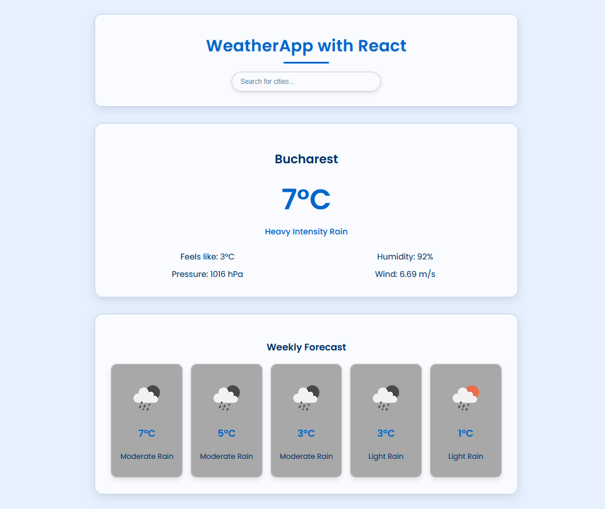
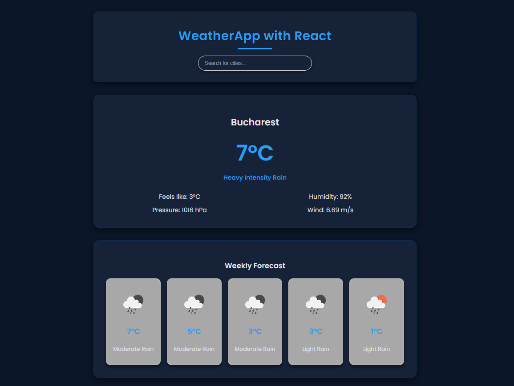

# 🌦️ WeatherApp with React

A clean, responsive weather application built with **React.js**, using the **OpenWeatherMap API** and **GeoDB Cities API**.  
The app provides real-time weather conditions, a 5-day forecast, and automatic light/dark theme switching.

---

## 🚀 Live Preview  
🔗 *(optional)* You can deploy your app on **Vercel** or **Netlify**, then place your live link here.  
Example: [https://weatherapp-react.vercel.app](https://weatherapp-react.vercel.app)

---

## 🖼️ Web Screenshots

### ☀️ Light Mode  


### 🌙 Dark Mode  
>>>>>>> 1e45ce2 (v1.0.0)


---

## ✨ Getting Started

- Make sure you already have `Node.js` and `npm` installed in your system.
- You need an API key from [OpenWeatherMap](https://openweathermap.org/). After creating an account, [grab your key](https://home.openweathermap.org/api_keys).
- Then, under the `src` directory, go to `api/OpenWeatherService` and replace `WEATHER_API_KEY` with your OpenWeatherMap API Key.
  - **`api/OpenWeatherService.js`**: It contains the code related to the back-end of the application.

<br/>

# ✨ Features (Web & Mobile)

## 🌐 React Web Version
- 🔍 Real-time city search powered by GeoDB API  
- 🌡️ Current weather: temperature, humidity, wind, pressure  
- 📅 5-day forecast with icons  
- 🌓 Light/Dark mode using CSS variables  
- ⚡ Fast API fetching with error handling  
- 📱 Fully responsive design  

## 📱 React Native Version
- 🔍 Autocomplete city search with GeoDB  
- ⚡ Optimized API fetching for mobile  
- 🌗 Light/Dark mode with theme objects  
- 🎨 Modern UI adapted for iOS & Android  
- 🧩 Reusable components (Search, TodayWeather, WeeklyForecast)  
- 📱 Designed to match the Web version UI  

---

# 🧠 Tech Stack

## 🌐 React Web
- React.js (CRA)
- CSS3 (custom themes)
- OpenWeatherMap API
- GeoDB Cities API (RapidAPI)

## 📱 React Native
- React Native + Expo
- JavaScript (Hooks)
- StyleSheet API
- OpenWeatherMap API
- GeoDB Cities API

---

# ⚙️ Installation & Setup

## 🌐 React Web

```bash
git clone https://github.com/hehealexandru/Weather-App-with-React.git
cd Weather-App-with-React
npm install
npm start
```

## 📱 React Native

```bash
git clone https://github.com/hehealexandru/Weather-App-with-React.git
cd weatherapp_native
#Create an .env file in the project root (Make sure to restart the development server after creating the .env file)
npx expo start
```
